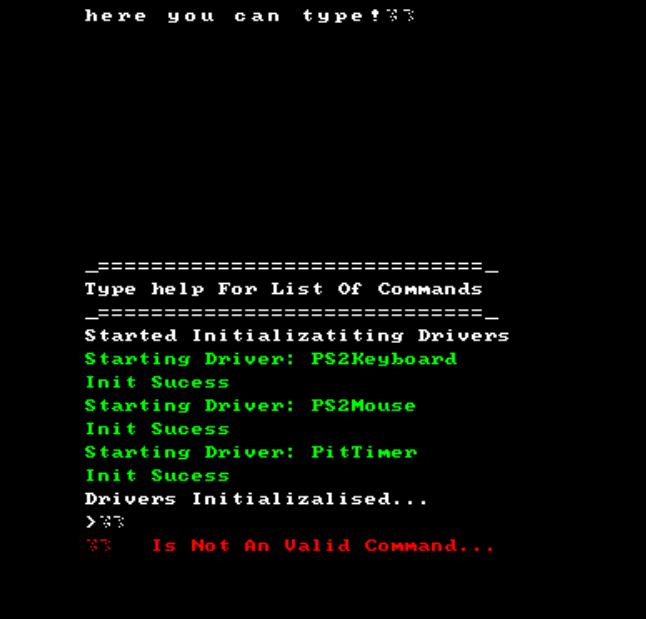
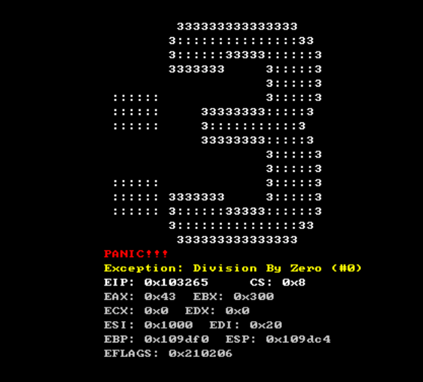

# Sigmacat-os: Simple Operating system

# Screenshots:

when using an VM use legacy Bios
Uefi Does not WORK!

# Tools Needed For Building/Develovement:
Note:
There May Be More ill Try To Update This...
im on Windows so some stuff may vary for linux
for windows i use WSL
the scripts might not be perfect so you may need to adjust
in make_iso.bat theres hardcoded paths, you need to change those

VM: I use VM-Ware but quemu would also most likely work

i686-elf Cross-Compiler Toolchain

NASM 

grub-mkrescue 
and grub tools i belive

Warning:
Iam not resposiable for anything you do with this, please use an virtual machine.
